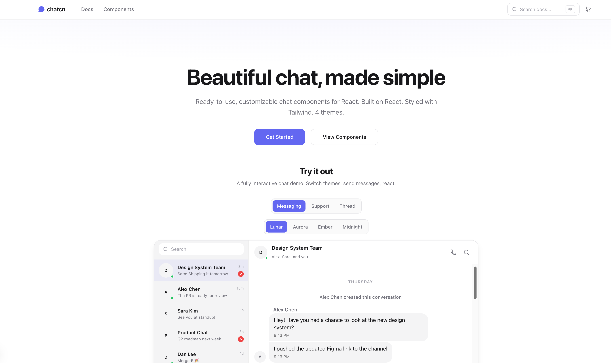
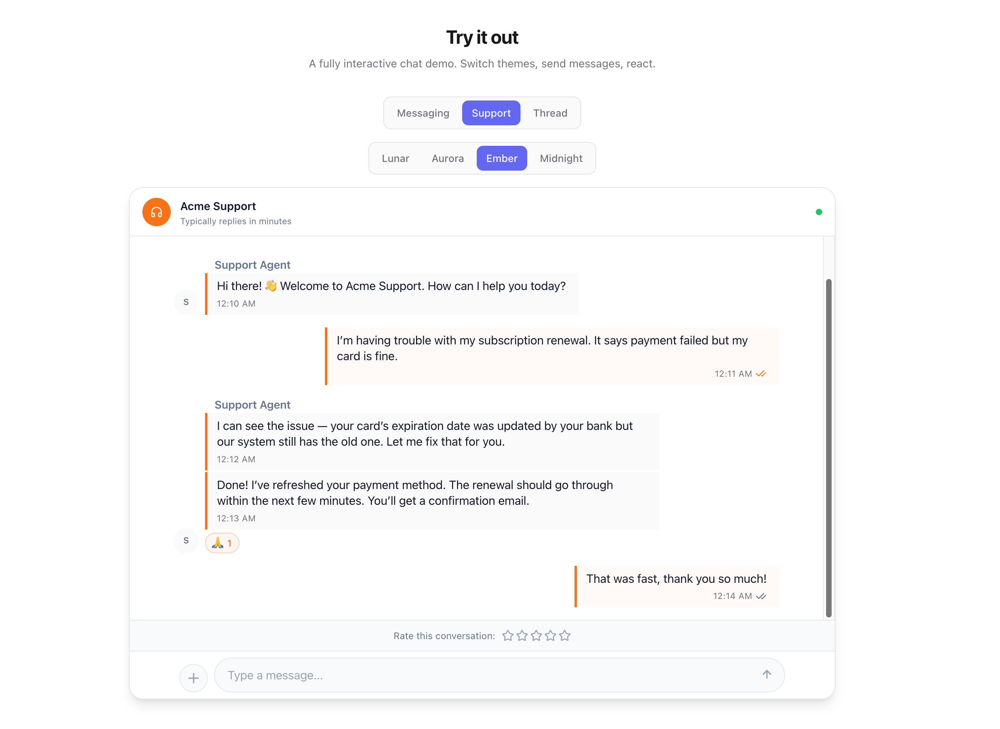

# chatcn

[](LICENSE)

Beautiful, ready-to-use chat UI components for React. Built on shadcn/ui. Styled with Tailwind CSS. 4 themes.



## Themes

<table>
  <tr>
    <td></td>
    <td></td>
  </tr>
  <tr>
    <td align="center"><strong>Aurora</strong> — Messaging</td>
    <td align="center"><strong>Ember</strong> — Support</td>
  </tr>
</table>

<table>
  <tr>
    <td></td>
  </tr>
  <tr>
    <td align="center"><strong>Lunar</strong> — Code blocks, file attachments, link previews</td>
  </tr>
</table>

## Features

- **Messages** — Bubbles, grouping, replies, reactions, read receipts
- **Composer** — Rich input with drag-and-drop file upload, voice recording
- **Media** — Images, files, voice messages, code blocks, link previews
- **Threads** — Flat and nested threading
- **Conversations** — Sidebar with search, unread counts, presence
- **4 Themes** — Lunar, Aurora, Ember, Midnight
- **5 Layouts** — FullMessenger, ChatWidget, InlineChat, ChatBoard, LiveChat
- **Accessible** — Keyboard navigation, screen reader support, reduced motion
- **TypeScript** — Fully typed props and exports

## Quick Start

```bash
npx shadcn@latest add https://raw.githubusercontent.com/leonickson1/chatcn/main/public/r/chat.json
```

Then import and use:

```tsx
import { ChatProvider, ChatMessages, ChatComposer } from "@/components/ui/chat"
import type { ChatUser } from "@/components/ui/chat"

const currentUser: ChatUser = { id: "user-1", name: "You", status: "online" }

export default function Chat() {
  return (
    <ChatProvider currentUser={currentUser} theme="lunar">
      <div className="h-screen flex flex-col">
        <ChatMessages messages={messages} />
        <ChatComposer onSend={(text) => console.log(text)} />
      </div>
    </ChatProvider>
  )
}
```

## Documentation

Visit [chatcn.vercel.app/docs](https://chatcn.vercel.app/docs) for full documentation, live demos, and API reference.

## License

[MIT](LICENSE)
